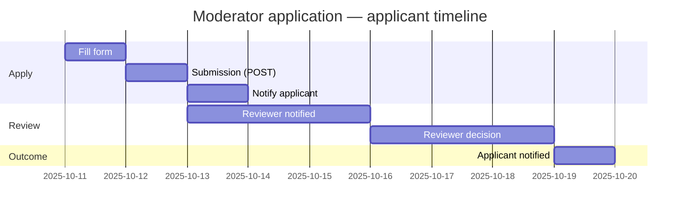

# Ticket.io

AI-powered Ticket Management System

---

## Features

- **User Authentication & Authorization**
   - JWT-based login/signup
   - Role-based access: User, Moderator, Admin
- **Ticket Management**
   - Create, view, and track support tickets
   - Skill-based moderator assignment
   - AI-generated ticket priority, notes, and skill extraction
- **Comments & Chat**
   - Admin/moderator can initiate chat on tickets
   - Users can reply to comments
   - Real-time chat-like UI for ticket discussions
   - Email notifications for new comments
- **Admin Dashboard**
   - View all users and tickets
   - Update user roles and skills
- **Moderator Application & Review Workflow**
   - Users can apply to become moderators through the frontend (skills as comma-separated list)
   - Admins/Moderators can review pending moderator applications, accept or reject
   - Accepted applicants are upgraded to the `moderator` role and their skills are merged into their profile
   - Applicants receive email notifications on submission and on decision
   - Endpoints: POST `/api/mod-requests` (apply), GET `/api/mod-requests/me` (applicant view), GET `/api/mod-requests` (list pending), POST `/api/mod-requests/:id/decide` (accept/reject)
- **Background Processing**
   - Inngest for event-driven ticket analysis and assignment
- **Notifications**
  - Email notifications for ticket assignment, comments, status changes and moderator workflow
  - Email sending now uses SendGrid HTTP API (set MAIL_API_KEY / SENDGRID_API_KEY and MAIL_FROM)
- **Frontend**
   - Modern React UI with Vite and Tailwind/DaisyUI
   - Responsive design
   - Pagination and sorting for tickets
- **Backend**
   - Node.js + Express REST API
   - MongoDB with Mongoose
   - Modular controllers, models, routes, and middlewares

---

## Usage

- **Sign Up:** Create a new user, moderator, or admin account.
- **Login:** Access your dashboard and tickets.
- **Create Ticket:** Submit a new support ticket.
- **Ticket Assignment:** AI matches ticket to moderator/admin based on skills.
- **Comment/Chat:** Admin/moderator can start a chat; users can reply.
- **Email Notifications:** Get notified for ticket assignment and new comments.
- **Admin Panel:** Manage users, roles, and view all tickets.
 - **Apply to Become Moderator:** Logged-in users (non-admin) can apply from the navbar -> Apply Moderator. Fill skills (comma-separated) and submit. Admins and moderators can review pending requests in the admin panel.

## Tech Stack
- **Frontend:** React, Vite, Tailwind CSS, DaisyUI
- **Backend:** Node.js, Express
- **Database:** MongoDB, Mongoose
- **AI:** Google Gemini API
- **Background Jobs:** Inngest
- **Email:** Nodemailer, Mailtrap

Note: The mailer was updated to prefer the SendGrid HTTP API. The project previously used nodemailer for SMTP testing; the production path uses SendGrid. Configure environment variables accordingly.

## User story — Apply to be a Moderator

As a registered user, I want to apply to become a moderator so that I can be considered to help triage and manage tickets matching my skills.

Acceptance criteria
- The user must be authenticated to apply.
- Admin users cannot apply (UI and backend validation prevent this).
- The application form asks for skills (comma-separated). Username and email are prefilled from the user's profile.
- If the user already has a pending application, the UI shows a clear message and prevents duplicate submissions.
- Admins and Moderators can view pending requests, inspect applicant details (username, email, skills, application time), and accept or reject applications.
- On accept, the applicant's role is set to `moderator`, their skills are merged into their profile, and an email notifies the applicant of the decision.
- On reject, an email notifies the applicant of the decision.

Developer notes
- Backend endpoints:
   - POST /api/mod-requests — Create a new moderator application (authenticated user)
   - GET /api/mod-requests/me — Get the authenticated user's latest application (if any)
   - GET /api/mod-requests — List pending applications (moderator/admin only)
   - POST /api/mod-requests/:id/decide — Accept or reject an application (moderator/admin only)
- Mailer: uses SendGrid API via environment variable `MAIL_API_KEY` / `SENDGRID_API_KEY` and `MAIL_FROM`.

Visualization timeline (applicant perspective)

If your Markdown renderer does not support Mermaid, the timeline reads: Apply → Submit → Reviewer notified → Reviewer decision → Applicant notified.

---

